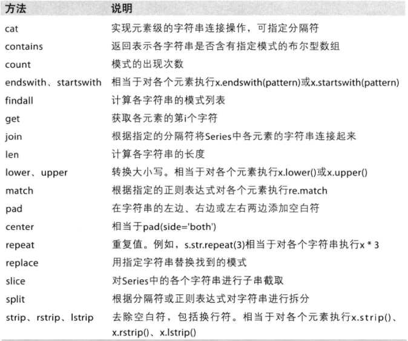

* content
{:toc}

第七章笔记


# 合并数据集

* pandas.merge可根据一个或多个键将不同DataFrame中的行连接起来。

*  pandas.concat可以沿着一条轴将多个对象堆叠到一起

* 实例方法combine_first可以将重复数据编接在一起，用一个对象中的值填充另一个对象中的缺失值。

### 数据库风格的DataFrame合并

数据集的合并（merge）或连接（join）运算是通过一个或多个键连接起来的。

merge中通过on指定键值，结果中的键是交集，其他不重叠的键将被去除。设置how = “outer”外链接可以取并集，how中的left和right则可以取左边或右边DataFrame的全集。

多对多链接产生的是行的笛卡尔积

### merge函数的参数

|参数|说明|
|--|--|
|left_on|参与合并的左侧DataFrame|
|right_on|参与合并的右侧DataFrame|
|left_index|将左侧的行索引引用作其连接键|
|right_index|类似于left_index|
|sort|根据连接键对合并后的数据进行排序，默认为True，有时在处理大数据集时，禁用该选项可获得更好的性能|
|suffixes|字符串元祖，用于追加到重叠列名的末尾，默认为('_x','_y')。例如，如果左右两个DataFrame对象都有“data”，则结果中就会出现“data_x", "data_y"|
|copy|设置为False，可以再某些特殊情况下避免将数据复制到结果数据结构中，默认总是复制|

### 索引上的合并

对于层次化索引的合并

```python
In [20]: righth
Out[20]: 
             event1  event2
Nevada 2001       0       1
       2000       2       3
Ohio   2000       4       5
       2000       6       7
       2001       8       9
       2002      10      11

In [21]: lefth
Out[21]: 
   data    key1  key2
0   0.0    Ohio  2000
1   1.0    Ohio  2001
2   2.0    Ohio  2002
3   3.0  Nevada  2001
4   4.0  Nevada  2002

In [22]: pd.merge(lefth,righth,left_on = ['key1','key2'],right_index = True)
Out[22]: 
   data    key1  key2  event1  event2
0   0.0    Ohio  2000       4       5
0   0.0    Ohio  2000       6       7
1   1.0    Ohio  2001       8       9
2   2.0    Ohio  2002      10      11
3   3.0  Nevada  2001       0       1

#可见需用left_on或right_on指定连接键
```

### 轴向连接

另一种数据合并运算也被称作连接（concatenation），绑定（binding）或堆叠（stacking）。Numpy有一个用于合并原始NumPy数组的concatenation函数：

```python
In [23]: arr = np.arange(12).reshape((3, 4))

In [24]: np.concatenate([arr, arr], axis =1)
Out[24]: 
array([[ 0,  1,  2,  3,  0,  1,  2,  3],
       [ 4,  5,  6,  7,  4,  5,  6,  7],
       [ 8,  9, 10, 11,  8,  9, 10, 11]])

In [25]: np.concatenate([arr, arr], axis =0)
Out[25]: 
array([[ 0,  1,  2,  3],
       [ 4,  5,  6,  7],
       [ 8,  9, 10, 11],
       [ 0,  1,  2,  3],
       [ 4,  5,  6,  7],
       [ 8,  9, 10, 11]])
```

Serires的concat方法

```python
In [60]: sr1
Out[60]: 
a    0
b    1
c    2
d    3
dtype: int64

In [61]: sr2
Out[61]: 
a    0
c    1
d    2
e    3
f    4
dtype: int64

In [62]: pd.concat([sr1, sr2], keys = ['sr1', 'sr2'])
Out[62]: 
sr1  a    0
     b    1
     c    2
     d    3
sr2  a    0
     c    1
     d    2
     e    3
     f    4
dtype: int64

In [63]: pd.concat([sr1, sr2], axis = 1,keys = ['sr1', 'sr2'])
Out[63]: 
   sr1  sr2
a  0.0  0.0
b  1.0  NaN
c  2.0  1.0
d  3.0  2.0
e  NaN  3.0
f  NaN  4.0
```

DataFrame的concat方法

```pyhton
In [46]: df1
Out[46]: 
   one  two
a    0    1
b    2    3
c    4    5

In [47]: df2
Out[47]: 
   three  four
a      5     6
c      7     8

In [48]: pd.concat([df1, df2], axis = 0, keys = ['level1', 'level2'])
Out[48]: 
          four  one  three  two
level1 a   NaN  0.0    NaN  1.0
       b   NaN  2.0    NaN  3.0
       c   NaN  4.0    NaN  5.0
level2 a   6.0  NaN    5.0  NaN
       c   8.0  NaN    7.0  NaN

In [49]: pd.concat([df1, df2], axis = 1, keys = ['level1', 'level2'])
Out[49]: 
  level1     level2     
     one two  three four
a      0   1    5.0  6.0
b      2   3    NaN  NaN
c      4   5    7.0  8.0

In [67]: pd.concat([df1, df2], axis = 1, keys = ['level1', 'level2'], names = ['level
    ...: ', 'num'])
Out[67]: 
level level1     level2     
num      one two  three four
a          0   1    5.0  6.0
b          2   3    NaN  NaN
c          4   5    7.0  8.0

In [68]: pd.concat([df1, df2], axis = 1, ignore_index = True)
Out[68]: 
   0  1    2    3
a  0  1  5.0  6.0
b  2  3  NaN  NaN
c  4  5  7.0  8.0

```

#### concat函数的参数

|参数|说明|
|--|--|
|obj|参与连接的pandas的对象的列表或字典，唯一必须的参数|
|axis|轴|
|join|“inner”，“outer”之一，默认“inner”|
|join_axes|指明用于其他n-1条轴的索引，不执行并集/交集运算|
|keys|与连接对象有关的值，用于形成连接轴向上的层次化索引|
|levels|指定用作层次化索引各级别上的索引，如果设置了keys的话|
|names| 用于创建分层级别的名称，如果设置了keys和（levels）的话|
|verify_intergrity|检查结果对象新轴上的重复情况，如果发现则引发异常。默认false允许重复|
|ignore_index|产生一组新索引range(total_length)

### 合并重叠数据

有一种数据组合不能用简单的合并（merge）或连接（concatenation）运算来处理。比如索引全部或部分重叠的两个数据集。

对于Series可以用where方法

* combine_first方法

Series

```python
In [83]: a
Out[83]: 
f    NaN
e    2.5
d    NaN
c    3.5
b    4.5
a    NaN
dtype: float64

In [84]: b
Out[84]: 
f    0.0
e    1.0
d    2.0
c    3.0
b    4.0
a    5.0
dtype: float64

In [85]: a.combine_first(b)
Out[85]: 
f    0.0
e    2.5
d    2.0
c    3.5
b    4.5
a    5.0
dtype: float64

In [86]: b[:-2].combine_first(a[2:])
Out[86]: 
a    NaN
b    4.5
c    3.0
d    2.0
e    1.0
f    0.0
dtype: float64
```

DataFrame

```python
In [80]: df1
Out[80]: 
     a    b   c
0  1.0  NaN   2
1  NaN  2.0   6
2  5.0  NaN  10
3  NaN  6.0  14

In [81]: df2
Out[81]: 
     a    b
0  5.0  NaN
1  4.0  3.0
2  NaN  4.0
3  3.0  6.0
4  7.0  8.0

In [82]: df1.combine_first(df2)
Out[82]: 
     a    b     c
0  1.0  NaN   2.0
1  4.0  2.0   6.0
2  5.0  4.0  10.0
3  3.0  6.0  14.0
4  7.0  8.0   NaN
```

combine_first会用参数对象中的数据为调用者对象的缺失数据打上补丁。

# 重塑(reshape)和轴转向(pivot)

### 重塑层次化索引

层次化索引为DataFrame的重排任务提供了一种具有良好一致性的方法。主要功能有：

* stack:将数据的列“旋转”为行
* unstack:将数据的行“旋转”为列

默认情况下，unstack和stack操作的是最内层（轴号最大）。

若不是所有级别值都能在个分组中找到的话，unstack可能会引入缺失数据。

stack默认会滤除缺失数据。因此该运算可逆。

对DataFrame进行unstack操作时，可指定旋转轴，作为旋转轴的级别将会成为结果中的最低级别。

### 将“长格式”旋转为“宽格式”

时间序列通常是以“长格式“和”堆叠格式“存储在数据库和csv中的。

pivot函数

## 数据转换

### 移除重复数据

DataFrame中的duplicated方法可以返回一个布尔型Serires，表示各行是否是重复行，而drop_duplicates，则可以删除重复行。这两个方法会默认判断全部列，也可以指定列进行过滤。

这两个方法默认是保留第一个出现的值组合，可以通过take_last = True保留最后一个。

### 利用函数或映射进行数据转换

```python
In [117]: data
Out[117]: 
          food  ounces
0        bacon     4.0
1  pulled pork     3.0
2        bacon    12.0
3     Pastrami     6.0
4  corned beef     7.5
5        Bacon     8.0
6     pastrami     3.0
7    honey ham     5.0
8     nova lox     6.0

In [118]: meat_to_animal = {
     ...: 'bacon' : 'pig', 'pulled pork': 'pig', 'pastrami': 'cow', 
     ...: 'corned beef': 'cow', 'honey ham': 'pig', 'nova lox': 'salmon'}

In [120]: data['food'].map(str.lower).map(meat_to_animal)
Out[120]: 
0       pig
1       pig
2       pig
3       cow
4       cow
5       pig
6       cow
7       pig
8    salmon

In [121]: data['food'].map(lambda x: meat_to_animal[x.lower()])
Out[121]: 
0       pig
1       pig
2       pig
3       cow
4       cow
5       pig
6       cow
7       pig
8    salmon
```

### 替换值

* replace方法

	可以接受字典,元组等结构
	
### 重命名轴索引

* rename方法
可实现复制DataFrame并对其索引和列进行复制,如果希望就地修改某个数据集,传入inplace = True 即可.

### 离散化和面元划分

* cut方法 和 qcut方法

### 检测和过滤异常

即数组运算

### 排列和随机采样

* numpy.random.permutation函数
可以轻松实现对Series和DataFrame的列的排列工作(permuting, 随机重排序).

通过需要排列的轴的长度调用permutation.可产生一个新顺序(随机)的整数数组,然后即可在基于ix的索引操作或take函数中使用该数组了.

```python
In [127]: df
Out[127]: 
    0   1   2   3
0   0   1   2   3
1   4   5   6   7
2   8   9  10  11
3  12  13  14  15
4  16  17  18  19

In [129]: sampler = np.random.permutation(5)

In [130]: sampler
Out[130]: array([0, 3, 1, 4, 2])

In [131]: df.take(sampler)
Out[131]: 
    0   1   2   3
0   0   1   2   3
3  12  13  14  15
1   4   5   6   7
4  16  17  18  19
2   8   9  10  11

In [132]: sampler = np.random.permutation(4)

In [133]: df.take(sampler, axis = 1)
Out[133]: 
    3   0   2   1
0   3   0   2   1
1   7   4   6   5
2  11   8  10   9
3  15  12  14  13
4  19  16  18  17
```

###　计算指标／哑变量

将分类变量(categorical variable)转换为哑变量矩阵(dummy matrix)或指标矩阵(indicator matrix)

如果DataFrame的某一列中含有k个不同的值,则可以派生出一个k列矩阵或DataFrame(其值全为1和0).pandas有一个get_dummies函数可以实现该功能.

```python
In [135]: pd.get_dummies(df['key'])
Out[135]: 
   a  b  c
0  0  1  0
1  0  1  0
2  1  0  0
3  0  0  1
4  1  0  0
5  0  1  0

In [136]: df
Out[136]: 
   data1 key
0      0   b
1      1   b
2      2   a
3      3   c
4      4   a
5      5   b
```

# 字符串操作

### 字符串对象方法

|方法|说明|
|:--|:--|
|count|返回子串在字符串中的出现次数(非重叠)|
|endswith,startswith|如果字符串以某个后缀结尾(以某个前缀开头),返回True|
|join|将字符串用作连接其他字符串序列的分隔符|
|index|如果在字符串中找到子串,则返回子串第一个字符所在的位置.如果没有找到,则引发ValueError|
|find|如果在字符串中找到子串,则返回第一个发现的子串的第一个字符所在的位置.如果没有找到,则返回-1|
|rfind|如果在字符串中找到子串,则返回最后一个发现的子串的第一个字符所在的位置.如果没有找到,返回-1|
|replace|替代|
|strip,rstrip,lstrip|去除空白符(包括换行符)|
|split|通过指定的分隔符将字符串拆分为一组子串|
|lower, upper|分别将字母字符转换为小写,大写|
|ljust, rjust|用空格(或其他字符)填充字符串的空白侧以返回符合最低宽度的字符串|

### 正则表达式(regex)

|方法|说明|
|--|--|
|findall, finditer|返回字符串中所有的非重叠匹配模式,findall返回的是由所有模式组成的列表,而finditer则通过一个迭代器逐个返回|
|match|从字符串起始位置匹配模式,还可以对模式各部分进行分组.如果匹配到模式, 则返回一个匹配项对象, 否则返回None|
|search| 扫描整个字符串以匹配模式. 如果找到则返回一个匹配对象. 跟match不同, 其匹配项可以位于字符串的任意位置, 而不仅仅是起始处|
|split| 根据找到的模式将字符串拆分为数段|
|sub, subn|将字符串中所有的(sub)或前n个(subn)模式替换为指定表达式,在替换字符串中可以通过\1, \2等符号表示各分组|

### 矢量化字符串方法
 
